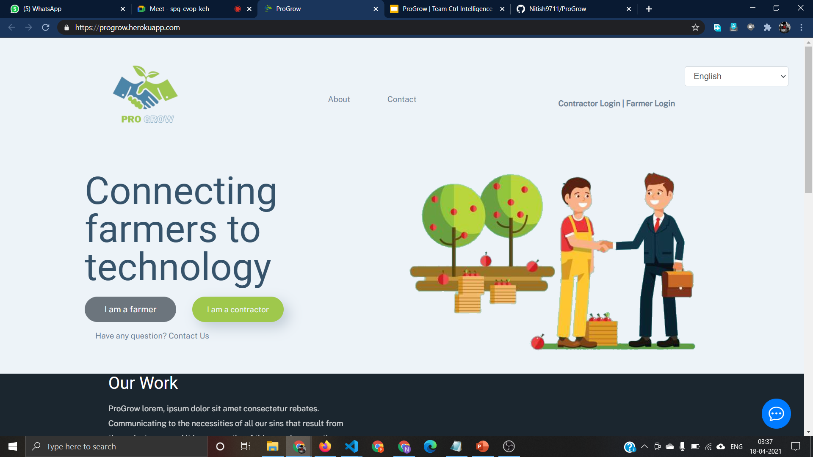
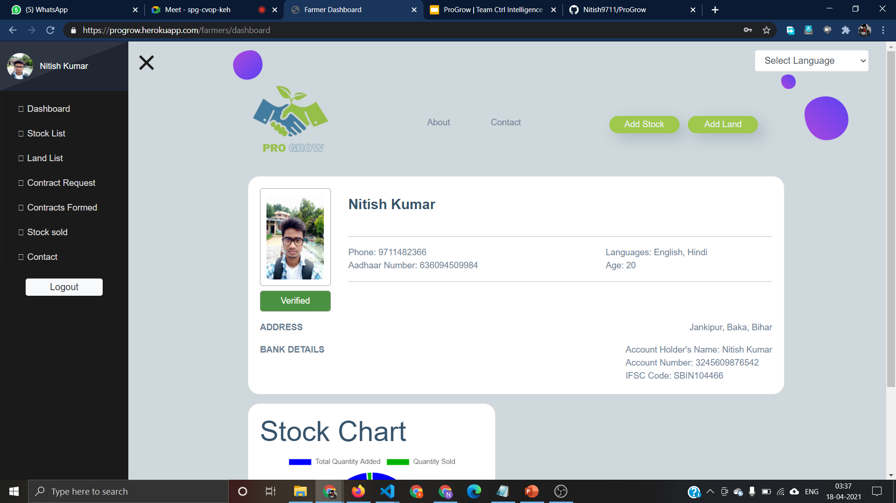
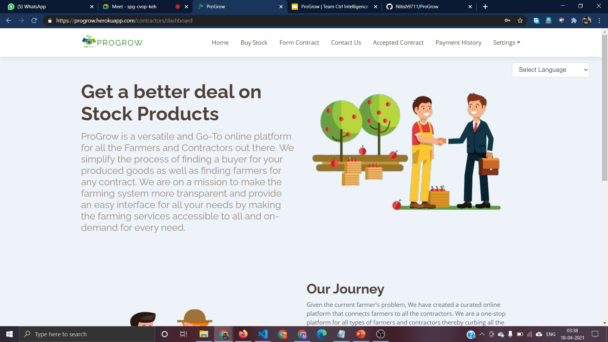
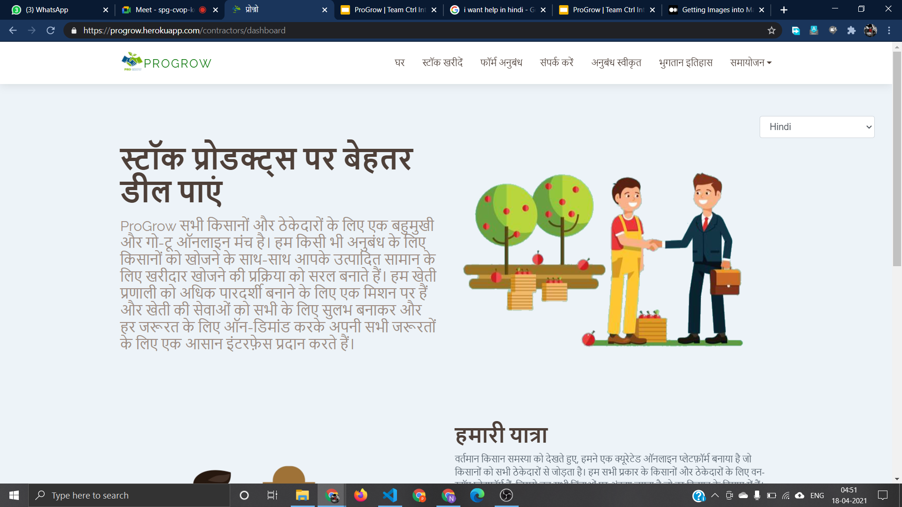

# ProGrow

#### *For connecting farmers to all the contractors*


## Table of Contents

- [ProGrow](#progrow)
  - [*For connecting farmers to all the contractors*](#for-connecting-farmers-to-all-the-contractors)
  - [Table of Contents](#table-of-contents)
  - [Website Demo](#website-demo)
  - [About](#about)
  - [Screenshots](#screenshots)
  - [Installation Prerequisites](#installation-prerequisites)
  - [How to Run this Website Locally](#how-to-run-this-website-locally)
  - [Technology Stack](#technology-stack)
  - [Contributors](#contributors)

## Website Demo

[Click Here to Watch Video]()  
[Click Here to See the Presentation](https://docs.google.com/presentation/d/1HBsWIlOIUaYAGLyz3aeXnn6IkOUGX1hDDlvm06By6hY/edit?usp=sharing)

[Website Link](https://progrow.herokuapp.com/)

## About

ProGrow is a versatile and Go-To online platform for all the Farmers and Contractors out there. We simplify the process of finding a buyer for your produced goods as well as finding farmers for any contract. We are on a mission to make the farming system more transparent and provide an easy interface for all your needs by making the farming services accessible to all and on-demand for every need.

Given the current farmer's problem, We have created a curated online platform that connects farmers to all the contractors. We are a one-stop platform for all types of farmers and contractors thereby curbing all the worries which are in the mind of every farmer.

Our motivation behind this idea was itself contract-based farming and it includes all the necessary features associated with it.

## Screenshots









## Installation Prerequisites

- Nodejs

> To Download Nodejs Package [Go to the Nodejs Download Website](https://nodejs.org/en/download/).

- Mongodb

> To install Mongodb [Go to this Website](https://docs.mongodb.com/manual/administration/install-community/)

## How to Run this Website Locally

1. Clone this Repo to your Local Machine.
2. Open The Terminal/CMD in the folder Janhit-Welfare.
3. Type ```mongod``` in your Terminal to Run mongodb Server (Ignore if already Running).
4. Type ```cd backend/jwa && npm install``` to download all the library.
5. Type ```npm start``` to run the nodejs server.
6. Open [localhost:300](localhost:3000/) in your browser.
7. Enjoy!!! :tada: :sparkles:

## Technology Stack

_The following technologies will be used to make this application -_

- _NodeJs_
- _Express_
- _Multer_
- _Passport_
- _Mongoose_
- _MongoDB Atlas_
- _ejs_

## Contributors

[Puneet Kumar Sehrawat](https://github.com/seneark)

[Nitish Kumar](https://github.com/Nitish9711)

[Parth gupta](https://github.com/Parth-Gupta10)

[Akshit Bansal](https://github.com/abansal755)

[Aditya Harsh](https://github.com/adityaharsh)
